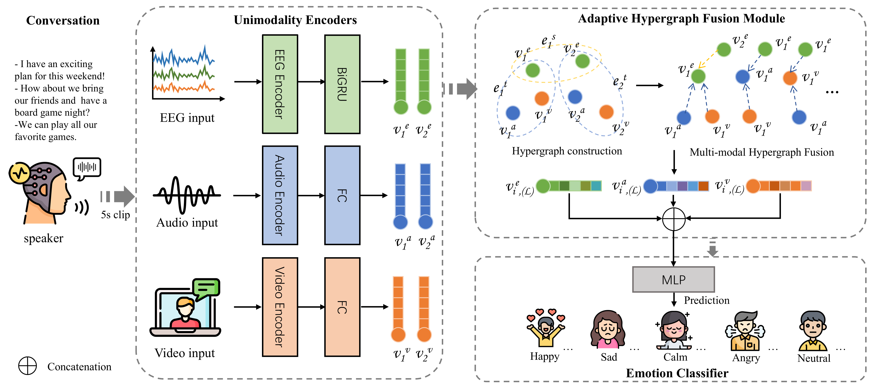

# Hypergraph Multi-Modal Learning for EEG-based Emotion Recognition in Conversation

<!-- Badges and Links Section -->
<div style="display: flex; align-items: center; justify-content: center;">

  <p align="center">
    <a href="[https://arxiv.org/abs/2412.17337](https://arxiv.org/abs/2502.21154)">
      
    </a>
  </p>

## Usage
This repo is the official implementation of Hypergraph Multi-Modal Learning for EEG-based Emotion Recognition in Conversation.

## Abstract
Emotional Recognition in Conversation (ERC) is a valuable approach for diagnosing health conditions such as autism or depression, as well as understanding emotions in individuals who struggle to express their feelings. Current ERC methods primarily rely on complete semantic textual information, including audio and visual data, but face challenges in integrating physiological signals such as Electroencephalography (EEG). This research proposes a novel framework of Hypergraph Multi-Modal Learning (Hyper-MML), designed to effectively identify emotions in conversation by integrating EEG with audio and video information to capture complex emotional dynamics. Firstly, we introduce the module of Adaptive Brain Encoder with Mutual-cross Attention (ABEMA) of EEG signals, which captures emotion-relevant features across different frequency bands while adapting to subject-specific variations through hierarchical mutual-cross attention mechanisms. Secondly, we propose a module of Adaptive Hypergraph Fusion (AHFM), which actively models higher-order relationships between multi-modal signals in ERC. Experimental results validated on the EAV and AFFEC datasets demonstrate that our Hyper-MML significantly outperforms the state-of-art methods in ERC. The proposed Hyper-MML can serve as an effective communication tool for healthcare professionals, enabling better engagement with patients who have difficulty expressing their emotions.

## Data availability


## Setting Up Your Environment and Dependencies
To ensure a clean and consistent working environment for this project, please follow these steps:

**1. Create and Activate a New Conda Environment**

First, create a dedicated Conda environment specifically for this project. This helps isolate project dependencies and prevents version conflicts with other projects.

```bash
conda create -n HyperMML python=3.8
```
Once the environment has been created, activate it using the following command:

```bash
conda activate HyperMML
```

**2. Install Required Dependencies**

With the environment activated, install all necessary dependencies using the `requirements.txt` file provided with the project. This file contains a list of all Python packages and their specific versions required for the project to function correctly.

```bash
pip install -r requirements.txt
```

**3. Verify Installation**

After the installation process completes, it's advisable to verify that all dependencies have been installed correctly. You can do this by checking the list of installed packages or by attempting to import key modules in a Python shell.

Additionally, you may want to list all Conda environments to ensure the environment was created and activated properly:

```bash
conda info --envs
```

By following these steps, you'll have a properly configured environment with all necessary dependencies installed, ensuring the project runs smoothly.

## Acknowledge

**Disclaimer: Our training framework uses the method provided in this article. Special thanks to Li et al. for their open source contributions. Excellent code logic and completeness.**
1. Chen F, Shao J, Zhu S, et al. Multivariate, multi-frequency and multimodal: Rethinking graph neural networks for emotion recognition in conversation[C]//Proceedings of the IEEE/CVF Conference on Computer Vision and Pattern Recognition. 2023: 10761-10770.
2. Lee M H, Shomanov A, Begim B, et al. EAV: EEG-audio-video dataset for emotion recognition in conversational contexts[J]. Scientific data, 2024, 11(1): 1026.
3. Sekiavandi M J, Dixen L, Fimland J, et al. Advancing Face-to-Face Emotion Communication: A Multimodal Dataset (AFFEC)[J]. arXiv preprint arXiv:2504.18969, 2025.

## Citation

If you find our work helpful to your research, we would appreciate a citation:

@article{kang2025hypergraph,
  title={Hypergraph multi-modal learning for eeg-based emotion recognition in conversation},
  author={Kang Zijian, Li Yueyang, Gong Shengyu, Zeng Weiming, Yan Hongjie, Bian Lingbin, Zhang Zhiguo, Siok Wai Ting and Wang Nizhuan},
  journal={arXiv preprint arXiv:2502.21154},
  year={2025}
}
